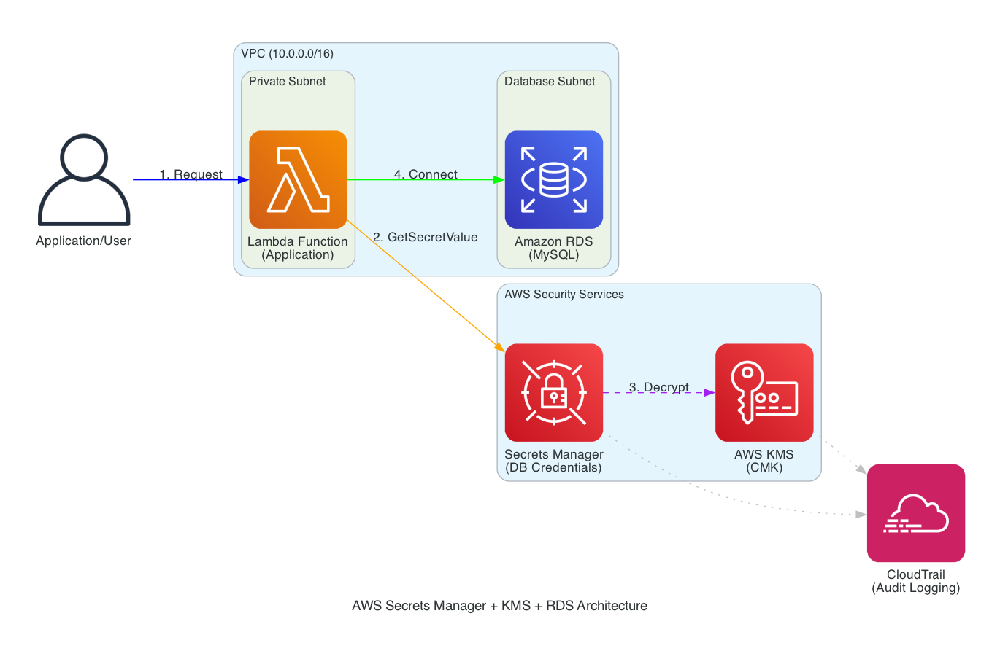

# Securing RDS Database Credentials with AWS KMS and Secrets Manager (Hands-On, Zero-Downtime Rotation)

[](https://aws.amazon.com/security/)
[](https://aws.amazon.com/kms/)
[](https://aws.amazon.com/secrets-manager/)
[]()
[]()

> **Security Engineering on AWS** - Hands-on Lab Series
> **Level:** Intermediate | **Time:** 30 minutes | **Cost:** ~$14-17/month

---

Modern applications still fail security basics by hardcoding database credentials in code, configuration files, or CI/CD pipelines. This lab addresses that problem by showing how to securely manage, encrypt, rotate, and audit database credentials on AWS using native services — without changing application code or causing downtime.

---

## What Are We Building Today?

In this lab, we build a **production-ready credential management system** for Amazon RDS that:

- Stores database passwords securely (never in plain text or code)
- Encrypts credentials using customer-managed encryption keys
- Rotates passwords automatically without application downtime
- Demonstrates zero-trust security principles

### Why Is This Important?

Here's how this lab solves common credential security problems:

| Problem | Solution |
|---------|----------|
| Hardcoded passwords in code | Centralized secret storage |
| Credentials in config files | Encrypted secrets with KMS |
| Manual password rotation | Automated zero-downtime rotation |
| No audit trail | CloudTrail logging for compliance |
| Shared credentials | Fine-grained IAM access control |

**Real-World Use Cases:**
- Web applications connecting to databases
- Microservices with shared credentials
- CI/CD pipelines needing secure secrets
- Compliance requirements (PCI-DSS, HIPAA, SOC2)

---

## AWS Services Used

This lab uses six AWS services working together to secure your RDS database credentials:

| Service | Purpose | What It Does |
|---------|---------|--------------|
| **AWS KMS** | Encryption | Creates and manages encryption keys for your secrets |
| **AWS Secrets Manager** | Secret Storage | Stores, retrieves, and rotates database credentials |
| **Amazon RDS** | Database | Managed MySQL database we're securing |
| **AWS Lambda** | Compute | Demonstrates serverless credential retrieval |
| **AWS IAM** | Access Control | Controls who can access secrets and keys |
| **AWS CloudTrail** | Auditing | Logs all secret access for compliance |

---

## Architecture Diagram

The diagram below shows how your application retrieves RDS credentials securely at runtime, with KMS handling encryption and CloudTrail providing an audit trail.



### How It Works (Text Version)

```
┌─────────────────────────────────────────────────────────────────────┐
│                        HOW IT WORKS                                  │
└─────────────────────────────────────────────────────────────────────┘

    ┌──────────────┐
    │  Your App    │
    │  (Lambda/EC2)│
    └──────┬───────┘
           │
           │ ① GetSecretValue()
           ▼
    ┌──────────────────────┐
    │   Secrets Manager    │──────────────┐
    │  ┌────────────────┐  │              │
    │  │ rds-credentials│  │              │ ③ Log Access
    │  │ {              │  │              │
    │  │  user: admin   │  │              ▼
    │  │  pass: ****    │  │       ┌─────────────┐
    │  │  host: rds.aws │  │       │ CloudTrail  │
    │  │ }              │  │       └─────────────┘
    │  └────────────────┘  │
    └──────────┬───────────┘
               │
               │ ② Decrypt
               ▼
    ┌──────────────────────┐
    │       AWS KMS        │
    │  ┌────────────────┐  │
    │  │ Customer Key   │  │
    │  │ (CMK)          │  │
    │  └────────────────┘  │
    └──────────────────────┘
               │
               │ ④ Connect with credentials
               ▼
    ┌──────────────────────┐
    │     Amazon RDS       │
    │     (MySQL)          │
    └──────────────────────┘
```

**Flow Explained:**
1. Application requests credentials from Secrets Manager
2. Secrets Manager uses KMS to decrypt the secret
3. CloudTrail logs the access for auditing
4. Application connects to RDS with decrypted credentials

---

## Prerequisites

Before starting, ensure you have:

- [ ] AWS CLI installed and configured (`aws --version`)
- [ ] Python 3.x installed (`python3 --version`)
- [ ] AWS account with admin permissions
- [ ] Basic understanding of databases

**Install Python dependencies:**
```bash
pip install boto3 pymysql
```

---

## Step-by-Step Implementation

### Step 1: Create a KMS Encryption Key (2 mins)

```bash
# Create the encryption key
aws kms create-key \
  --description "RDS Secrets Encryption Key" \
  --region us-east-1

# Note the KeyId from output, then create an alias
aws kms create-alias \
  --alias-name alias/rds-secrets-key \
  --target-key-id <YOUR_KEY_ID> \
  --region us-east-1

# Verify
aws kms describe-key --key-id alias/rds-secrets-key --region us-east-1
```

**What this does:** Creates a customer-managed encryption key that only you control.

---

### Step 2: Create an RDS Database (10 mins)

```bash
# Generate a secure password
DB_PASSWORD=$(openssl rand -base64 24 | tr -d "=+/")
echo "Save this password: $DB_PASSWORD"

# Create RDS instance
aws rds create-db-instance \
  --db-instance-identifier security-lab-db \
  --db-instance-class db.t3.micro \
  --engine mysql \
  --master-username admin \
  --master-user-password "$DB_PASSWORD" \
  --allocated-storage 20 \
  --publicly-accessible \
  --region us-east-1

# Wait for database to be ready (takes 5-10 mins)
echo "Waiting for database..."
aws rds wait db-instance-available \
  --db-instance-identifier security-lab-db \
  --region us-east-1

# Get the database endpoint
DB_HOST=$(aws rds describe-db-instances \
  --db-instance-identifier security-lab-db \
  --query 'DBInstances[0].Endpoint.Address' \
  --output text \
  --region us-east-1)
echo "Database endpoint: $DB_HOST"
```

**What this does:** Creates a MySQL database that we'll secure with Secrets Manager.

---

### Step 3: Store Credentials in Secrets Manager (2 mins)

```bash
# Create the secret with KMS encryption
aws secretsmanager create-secret \
  --name rds-db-credentials \
  --description "Database credentials for security lab" \
  --kms-key-id alias/rds-secrets-key \
  --secret-string "{\"username\":\"admin\",\"password\":\"$DB_PASSWORD\",\"host\":\"$DB_HOST\",\"port\":3306}" \
  --region us-east-1

# Verify the secret exists
aws secretsmanager describe-secret \
  --secret-id rds-db-credentials \
  --region us-east-1
```

**What this does:** Stores credentials encrypted with your KMS key.

---

### Step 4: Test the Connection (2 mins)

Create `test-connection.py`:

```python
#!/usr/bin/env python3
"""
Test RDS connection using credentials from Secrets Manager.
This demonstrates how applications should retrieve database credentials.
"""
import json
import boto3
import pymysql

def get_secret():
    """Retrieve and decrypt the database credentials."""
    client = boto3.client('secretsmanager', region_name='us-east-1')
    response = client.get_secret_value(SecretId='rds-db-credentials')
    return json.loads(response['SecretString'])

def test_connection():
    """Connect to RDS using the retrieved credentials."""
    print("🔐 Retrieving credentials from Secrets Manager...")
    secret = get_secret()

    print(f"📡 Connecting to: {secret['host']}")

    connection = pymysql.connect(
        host=secret['host'],
        user=secret['username'],
        password=secret['password'],
        port=secret['port'],
        connect_timeout=10
    )

    with connection.cursor() as cursor:
        cursor.execute("SELECT VERSION()")
        version = cursor.fetchone()[0]

    connection.close()
    print(f"✅ Connected successfully! MySQL version: {version}")

if __name__ == "__main__":
    test_connection()
```

Run it:
```bash
python3 test-connection.py
```

**Expected output:**
```
🔐 Retrieving credentials from Secrets Manager...
📡 Connecting to: security-lab-db.xxx.us-east-1.rds.amazonaws.com
✅ Connected successfully! MySQL version: 8.0.35
```

---

### Step 5: Rotate the Password (5 mins)

```bash
# Generate new password
NEW_PASSWORD=$(openssl rand -base64 24 | tr -d "=+/")

# Get current secret and update password
CURRENT=$(aws secretsmanager get-secret-value \
  --secret-id rds-db-credentials \
  --query 'SecretString' \
  --output text \
  --region us-east-1)

UPDATED=$(echo $CURRENT | python3 -c "import sys,json; d=json.load(sys.stdin); d['password']='$NEW_PASSWORD'; print(json.dumps(d))")

# Update Secrets Manager
aws secretsmanager update-secret \
  --secret-id rds-db-credentials \
  --secret-string "$UPDATED" \
  --region us-east-1

# Update RDS password
aws rds modify-db-instance \
  --db-instance-identifier security-lab-db \
  --master-user-password "$NEW_PASSWORD" \
  --apply-immediately \
  --region us-east-1

# Wait for RDS update
aws rds wait db-instance-available \
  --db-instance-identifier security-lab-db \
  --region us-east-1

echo "✅ Password rotated successfully!"
```

**Test again:**
```bash
python3 test-connection.py
```

**Key insight:** The application code didn't change, but it now uses the new password!

---

## Quick Deploy Option

Don't want to run commands manually? Use the automated script:

```bash
# Deploy everything
./scripts/deploy.sh

# Test connection
python3 src/test-connection.py

# Rotate password
./scripts/rotate-secret.sh

# Test again (still works!)
python3 src/test-connection.py
```

---

## Cleanup Script

**Important:** Run this when done to avoid charges.

```bash
#!/bin/bash
# cleanup.sh - Remove all lab resources

echo "🧹 Cleaning up resources..."

# Delete secret
aws secretsmanager delete-secret \
  --secret-id rds-db-credentials \
  --force-delete-without-recovery \
  --region us-east-1

# Delete RDS instance
aws rds delete-db-instance \
  --db-instance-identifier security-lab-db \
  --skip-final-snapshot \
  --region us-east-1

echo "⏳ Waiting for RDS deletion..."
aws rds wait db-instance-deleted \
  --db-instance-identifier security-lab-db \
  --region us-east-1

# Schedule KMS key deletion (7-day minimum wait)
KEY_ID=$(aws kms describe-key --key-id alias/rds-secrets-key --query 'KeyMetadata.KeyId' --output text --region us-east-1)
aws kms schedule-key-deletion \
  --key-id $KEY_ID \
  --pending-window-in-days 7 \
  --region us-east-1

echo "✅ Cleanup complete!"
echo "⚠️  KMS key will be deleted in 7 days (AWS minimum)"
```

Run cleanup:
```bash
./scripts/cleanup.sh
```

---

## Cost Breakdown

| Service | Cost | Notes |
|---------|------|-------|
| **AWS KMS** | $1.00/month | Per customer-managed key |
| **Secrets Manager** | $0.40/month | Per secret stored |
| **RDS db.t3.micro** | ~$12-15/month | On-demand pricing |
| **API Calls** | ~$0.10/month | KMS & Secrets Manager requests |
| **Total** | **~$14-17/month** | |

**Cost Optimization Tips:**
- Use `db.t3.micro` for learning (free tier eligible for 12 months)
- Delete resources when not in use
- KMS keys have 7-day deletion waiting period

---

## What We Learned Today

| Concept | What You Now Know |
|---------|-------------------|
| **Secret Storage** | Never hardcode credentials; use Secrets Manager |
| **Encryption** | Customer-managed KMS keys give you full control |
| **Rotation** | Passwords can be rotated without code changes |
| **Access Control** | IAM policies control who can access secrets |
| **Auditing** | CloudTrail logs all credential access |
| **Zero Trust** | Applications request credentials at runtime |

---

## Best Practices

### Do's ✅

| Practice | Why |
|----------|-----|
| Use customer-managed KMS keys | Full control over encryption |
| Enable automatic rotation | Reduce credential exposure time |
| Apply least-privilege IAM | Only grant necessary permissions |
| Enable CloudTrail logging | Audit and compliance |
| Use VPC endpoints | Keep traffic off public internet |
| Tag all resources | Cost tracking and organization |

### Don'ts ❌

| Anti-Pattern | Risk |
|--------------|------|
| Hardcode credentials | Credentials leaked in source control |
| Share database passwords | No accountability |
| Skip encryption | Data exposed if breached |
| Ignore rotation | Stale credentials are risky |
| Over-provision IAM | Increases attack surface |

---

## AWS Well-Architected Alignment

This lab implements practices from the [AWS Well-Architected Framework - Security Pillar](https://docs.aws.amazon.com/wellarchitected/latest/security-pillar/welcome.html):

| Principle | How This Lab Implements It |
|-----------|---------------------------|
| **SEC01** - Operate workloads securely | Encrypted secrets, least-privilege IAM |
| **SEC02** - Protect data in transit | TLS connections to RDS and Secrets Manager |
| **SEC07** - Protect data at rest | KMS encryption for all credentials |
| **SEC08** - Classify data | Credentials stored separately from application code |
| **SEC10** - Anticipate incidents | CloudTrail logging for forensics |

---

## AWS Documentation References

| Topic | Link |
|-------|------|
| **AWS Well-Architected Framework** | [Security Pillar](https://docs.aws.amazon.com/wellarchitected/latest/security-pillar/welcome.html) |
| AWS Secrets Manager | [User Guide](https://docs.aws.amazon.com/secretsmanager/latest/userguide/) |
| AWS KMS | [Developer Guide](https://docs.aws.amazon.com/kms/latest/developerguide/) |
| RDS Security | [Best Practices](https://docs.aws.amazon.com/AmazonRDS/latest/UserGuide/CHAP_BestPractices.Security.html) |
| Secret Rotation | [Rotation Guide](https://docs.aws.amazon.com/secretsmanager/latest/userguide/rotating-secrets.html) |
| IAM Best Practices | [Security Guide](https://docs.aws.amazon.com/IAM/latest/UserGuide/best-practices.html) |

---

## Project Structure

```
Securing RDS Database Credentials.../
├── README.md              # This file
├── images/
│   └── aws-architecture-diagram.png
├── scripts/
│   ├── deploy.sh          # Automated deployment
│   ├── rotate-secret.sh   # Password rotation
│   └── cleanup.sh         # Resource cleanup
├── src/
│   └── test-connection.py # Connection test script
├── configs/
│   └── kms-key-policy.json # KMS policy template
└── requirements.txt       # Python dependencies
```

---

## Troubleshooting

| Error | Solution |
|-------|----------|
| `Connection timeout` | Check RDS security group allows port 3306 |
| `Access denied to secret` | Verify IAM permissions for Secrets Manager |
| `KMS decrypt error` | Check KMS key policy includes your IAM role |
| `RDS not available` | Wait 5-10 mins for instance creation |

---

## Next Steps

After completing this lab, try:

1. **Enable automatic rotation** using Lambda rotation functions
2. **Add VPC endpoints** for private Secrets Manager access
3. **Set up CloudWatch alarms** for unusual secret access patterns
4. **Implement multi-region** secret replication

---

## Contributing

Found an issue or want to improve this lab?

1. Fork the repository
2. Create a feature branch
3. Submit a pull request

**Guidelines:**
- No credentials in code
- Test all scripts before submitting
- Follow existing documentation style

---

**Don't just read—build.** The most effective way to master AWS security is through hands-on practice. Deploy this lab, experiment freely, intentionally break things, fix them, and develop a deep, practical understanding of how AWS KMS and AWS Secrets Manager work together to secure real-world applications. This is where theory transforms into intuition—and learning becomes a lasting skill.

**Happy Learning! 🎓**

Created by **[Learn Cloud with Shashank](https://www.linkedin.com/in/shashankk/)**, an AWS Solutions Architect and Golden Jacket Holder, as part of the *Security Engineering on AWS Hands-on Labs Series*.

---

## License

MIT License - Free to use for learning and commercial projects.
